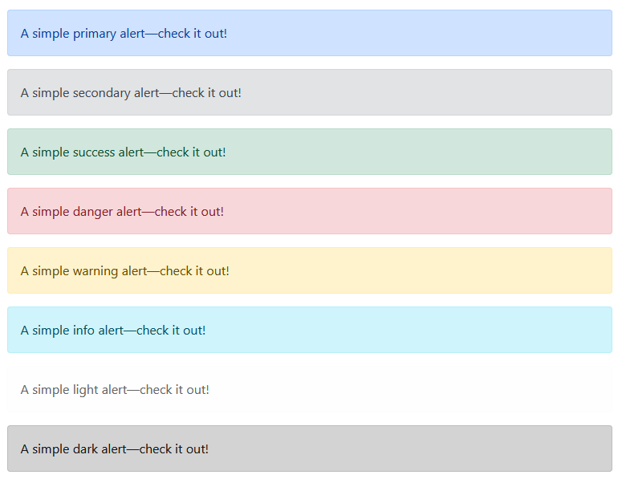

# 1 - Page Link

```
https://getbootstrap.com/docs/5.0/components/alerts/
```

# 2 - Examples

Alerts are available for any length of text, as well as an optional close button.

For proper styling, use one of the eight required contextual classes (e.g., .alert-success). 

For inline dismissal, use the alerts JavaScript plugin.

```html
<!DOCTYPE html>
<html lang="en">
<head>
    <meta charset="UTF-8">
    <meta name="viewport" content="width=device-width, initial-scale=1.0">
    <title>Document</title>

    <!-- Bootstrap CSS -->
    <link href="https://cdn.jsdelivr.net/npm/bootstrap@5.0.2/dist/css/bootstrap.min.css" rel="stylesheet" integrity="sha384-EVSTQN3/azprG1Anm3QDgpJLIm9Nao0Yz1ztcQTwFspd3yD65VohhpuuCOmLASjC" crossorigin="anonymous">

</head>
<body>

    <div class="alert alert-primary" role="alert">
    A simple primary alert—check it out!
    </div>

    <div class="alert alert-secondary" role="alert">
    A simple secondary alert—check it out!
    </div>

    <div class="alert alert-success" role="alert">
    A simple success alert—check it out!
    </div>

    <div class="alert alert-danger" role="alert">
    A simple danger alert—check it out!
    </div>

    <div class="alert alert-warning" role="alert">
    A simple warning alert—check it out!
    </div>

    <div class="alert alert-info" role="alert">
    A simple info alert—check it out!
    </div>

    <div class="alert alert-light" role="alert">
    A simple light alert—check it out!
    </div>

    <div class="alert alert-dark" role="alert">
    A simple dark alert—check it out!
    </div>

    <!-- Optional JavaScript; choose one of the two! -->

    <!-- Option 1: Bootstrap Bundle with Popper -->
    <script src="https://cdn.jsdelivr.net/npm/bootstrap@5.0.2/dist/js/bootstrap.bundle.min.js" integrity="sha384-MrcW6ZMFYlzcLA8Nl+NtUVF0sA7MsXsP1UyJoMp4YLEuNSfAP+JcXn/tWtIaxVXM" crossorigin="anonymous"></script>
</body>
</html>
```

Conveying meaning to assistive technologies

Using color to add meaning only provides a visual indication, which will not be conveyed to users of 
assistive technologies – such as screen readers. Ensure that information denoted by the color is 
either obvious from the content itself (e.g. the visible text), or is included through alternative means, 
such as additional text hidden with the .visually-hidden class. 



# 4 - Link color

Use the .alert-link utility class to quickly provide matching colored links within any alert.

```html
<!DOCTYPE html>
<html lang="en">
<head>
    <meta charset="UTF-8">
    <meta name="viewport" content="width=device-width, initial-scale=1.0">
    <title>Document</title>

    <!-- Bootstrap CSS -->
    <link href="https://cdn.jsdelivr.net/npm/bootstrap@5.0.2/dist/css/bootstrap.min.css" rel="stylesheet" integrity="sha384-EVSTQN3/azprG1Anm3QDgpJLIm9Nao0Yz1ztcQTwFspd3yD65VohhpuuCOmLASjC" crossorigin="anonymous">

</head>
<body>

    <div class="alert alert-primary" role="alert">
    A simple primary alert with <a href="#" class="alert-link">an example link</a>. Give it a click if you like.
    </div>

    <div class="alert alert-secondary" role="alert">
    A simple secondary alert with <a href="#" class="alert-link">an example link</a>. Give it a click if you like.
    </div>

    <div class="alert alert-success" role="alert">
    A simple success alert with <a href="#" class="alert-link">an example link</a>. Give it a click if you like.
    </div>

    <div class="alert alert-danger" role="alert">
    A simple danger alert with <a href="#" class="alert-link">an example link</a>. Give it a click if you like.
    </div>

    <div class="alert alert-warning" role="alert">
    A simple warning alert with <a href="#" class="alert-link">an example link</a>. Give it a click if you like.
    </div>

    <div class="alert alert-info" role="alert">
    A simple info alert with <a href="#" class="alert-link">an example link</a>. Give it a click if you like.
    </div>

    <div class="alert alert-light" role="alert">
    A simple light alert with <a href="#" class="alert-link">an example link</a>. Give it a click if you like.
    </div>

    <div class="alert alert-dark" role="alert">
    A simple dark alert with <a href="#" class="alert-link">an example link</a>. Give it a click if you like.
    </div>

<!-- Optional JavaScript; choose one of the two! -->

    <!-- Option 1: Bootstrap Bundle with Popper -->
    <script src="https://cdn.jsdelivr.net/npm/bootstrap@5.0.2/dist/js/bootstrap.bundle.min.js" integrity="sha384-MrcW6ZMFYlzcLA8Nl+NtUVF0sA7MsXsP1UyJoMp4YLEuNSfAP+JcXn/tWtIaxVXM" crossorigin="anonymous"></script>
</body>
</html>
```