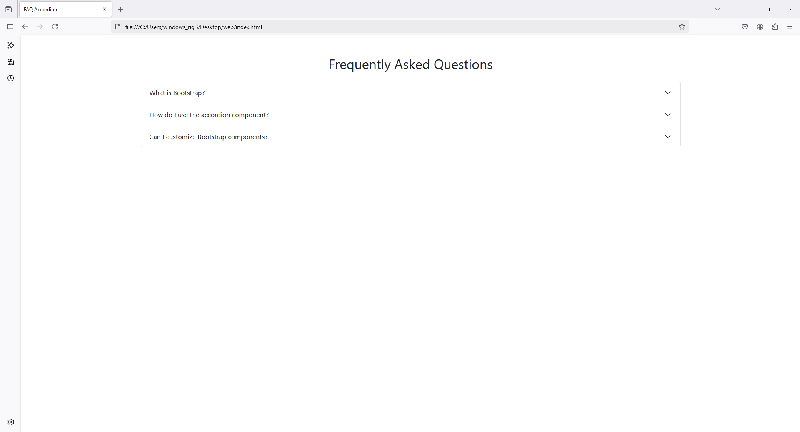
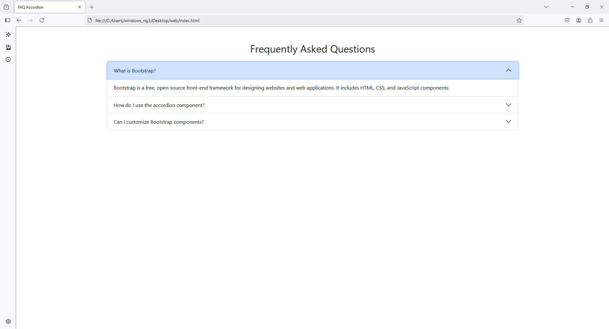

Here's a Bootstrap 5 FAQ layout using an accordion component:

### HTML Code:
```html
<!DOCTYPE html>
<html lang="en">
<head>
    <meta charset="UTF-8">
    <meta name="viewport" content="width=device-width, initial-scale=1.0">
    <title>FAQ Accordion</title>
    <!-- Bootstrap 5 CSS -->
    <link href="https://cdn.jsdelivr.net/npm/bootstrap@5.3.0-alpha3/dist/css/bootstrap.min.css" rel="stylesheet">
</head>
<body>
    <div class="container my-5">
        <h2 class="text-center mb-4">Frequently Asked Questions</h2>
        <div class="accordion" id="faqAccordion">
            <!-- FAQ Item 1 -->
            <div class="accordion-item">
                <h2 class="accordion-header" id="headingOne">
                    <button class="accordion-button" type="button" data-bs-toggle="collapse" data-bs-target="#collapseOne" aria-expanded="true" aria-controls="collapseOne">
                        What is Bootstrap?
                    </button>
                </h2>
                <div id="collapseOne" class="accordion-collapse collapse show" aria-labelledby="headingOne" data-bs-parent="#faqAccordion">
                    <div class="accordion-body">
                        Bootstrap is a free, open-source front-end framework for designing websites and web applications. It includes HTML, CSS, and JavaScript components.
                    </div>
                </div>
            </div>
            <!-- FAQ Item 2 -->
            <div class="accordion-item">
                <h2 class="accordion-header" id="headingTwo">
                    <button class="accordion-button collapsed" type="button" data-bs-toggle="collapse" data-bs-target="#collapseTwo" aria-expanded="false" aria-controls="collapseTwo">
                        How do I use the accordion component?
                    </button>
                </h2>
                <div id="collapseTwo" class="accordion-collapse collapse" aria-labelledby="headingTwo" data-bs-parent="#faqAccordion">
                    <div class="accordion-body">
                        The accordion component in Bootstrap is used to create collapsible content. Use the classes provided by Bootstrap and ensure proper structure for functionality.
                    </div>
                </div>
            </div>
            <!-- FAQ Item 3 -->
            <div class="accordion-item">
                <h2 class="accordion-header" id="headingThree">
                    <button class="accordion-button collapsed" type="button" data-bs-toggle="collapse" data-bs-target="#collapseThree" aria-expanded="false" aria-controls="collapseThree">
                        Can I customize Bootstrap components?
                    </button>
                </h2>
                <div id="collapseThree" class="accordion-collapse collapse" aria-labelledby="headingThree" data-bs-parent="#faqAccordion">
                    <div class="accordion-body">
                        Yes, Bootstrap components can be customized using custom CSS or by overriding the default Bootstrap styles.
                    </div>
                </div>
            </div>
        </div>
    </div>

    <!-- Bootstrap 5 JS -->
    <script src="https://cdn.jsdelivr.net/npm/bootstrap@5.3.0-alpha3/dist/js/bootstrap.bundle.min.js"></script>
</body>
</html>
```

### Key Features:
1. **Accordion Structure**: Uses `accordion` and `accordion-item` classes for organizing FAQ items.
2. **Collapse Functionality**: Each question can be expanded or collapsed independently.
3. **Customizable**: Replace the text with your specific FAQ content.
4. **Responsive Design**: Automatically adjusts to different screen sizes.

Feel free to modify the `accordion-item` sections to add or remove FAQ items.



