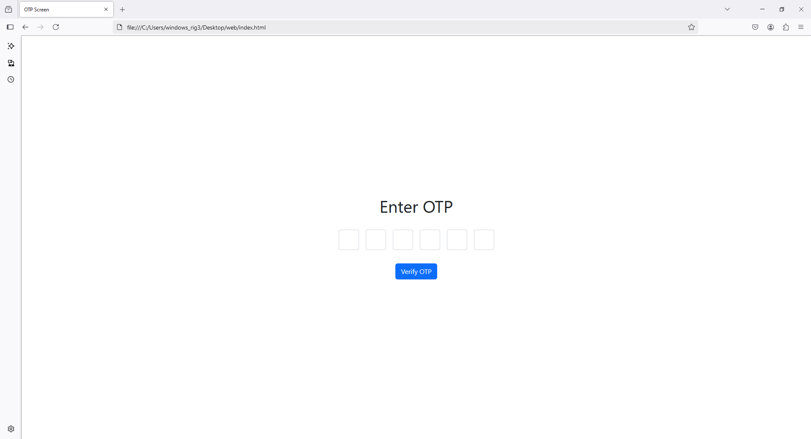
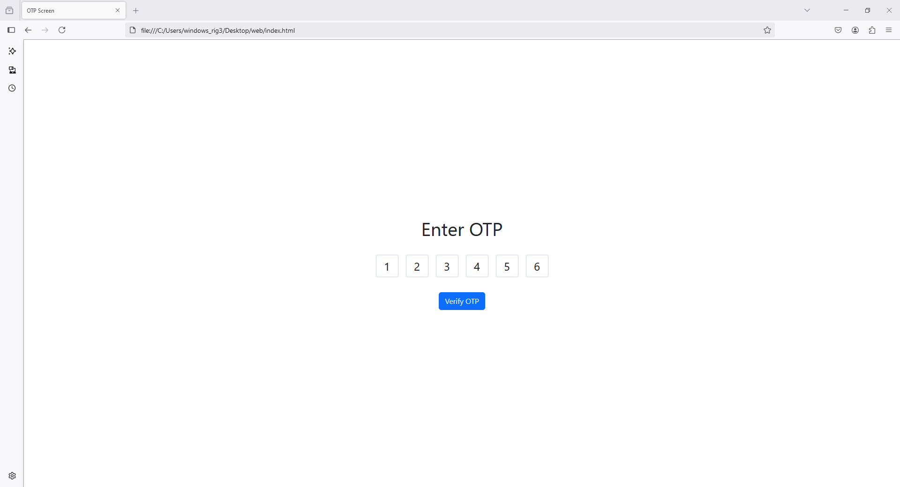

Here’s how you can design a 6-digit OTP screen using Bootstrap 5 with input masking using jQuery:

### HTML
```html
<!DOCTYPE html>
<html lang="en">
<head>
  <meta charset="UTF-8">
  <meta name="viewport" content="width=device-width, initial-scale=1.0">
  <title>OTP Screen</title>
  <link href="https://cdn.jsdelivr.net/npm/bootstrap@5.3.0-alpha1/dist/css/bootstrap.min.css" rel="stylesheet">
  <script src="https://code.jquery.com/jquery-3.6.0.min.js"></script>
  <style>
    .otp-input {
      width: 3rem;
      height: 3rem;
      text-align: center;
      font-size: 1.5rem;
      margin: 0.5rem;
      border: 1px solid #ced4da;
      border-radius: 0.25rem;
    }
  </style>
</head>
<body>
<div class="container d-flex justify-content-center align-items-center vh-100">
  <div class="text-center">
    <h1 class="mb-4">Enter OTP</h1>
    <form id="otp-form" autocomplete="off">
      <div class="d-flex justify-content-center">
        <input type="password" maxlength="1" class="otp-input form-control" id="digit-1">
        <input type="password" maxlength="1" class="otp-input form-control" id="digit-2">
        <input type="password" maxlength="1" class="otp-input form-control" id="digit-3">
        <input type="password" maxlength="1" class="otp-input form-control" id="digit-4">
        <input type="password" maxlength="1" class="otp-input form-control" id="digit-5">
        <input type="password" maxlength="1" class="otp-input form-control" id="digit-6">
      </div>
      <button type="submit" class="btn btn-primary mt-4">Verify OTP</button>
    </form>
  </div>
</div>

<script>
  $(document).ready(function () {
    $(".otp-input").on("input", function (e) {
      const current = $(this);
      const next = current.next(".otp-input");
      const prev = current.prev(".otp-input");

      // Move to next input box if a digit is entered
      if (current.val().length === 1) {
        next.focus();
      }

      // Backspace handling
      if (e.key === "Backspace" || e.keyCode === 8) {
        prev.focus();
      }
    });

    $("#otp-form").on("submit", function (e) {
      e.preventDefault();
      let otp = "";
      $(".otp-input").each(function () {
        otp += $(this).val();
      });
      alert("Entered OTP: " + otp);
    });
  });
</script>
<script src="https://cdn.jsdelivr.net/npm/bootstrap@5.3.0-alpha1/dist/js/bootstrap.bundle.min.js"></script>
</body>
</html>
```

### Explanation:
1. **Bootstrap Styles**: Used for layout and responsive design.
2. **Input Masking**: 
   - Each OTP digit is placed in a separate input field.
   - `type="password"` masks the input.
3. **jQuery Logic**:
   - Automatically moves to the next input when a digit is entered.
   - Supports `Backspace` for navigating back to the previous input.
4. **Form Submission**:
   - Collects OTP values and displays them as an alert.

This design is user-friendly and works seamlessly for both desktop and mobile devices.



