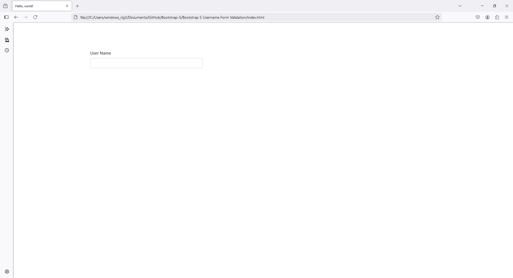
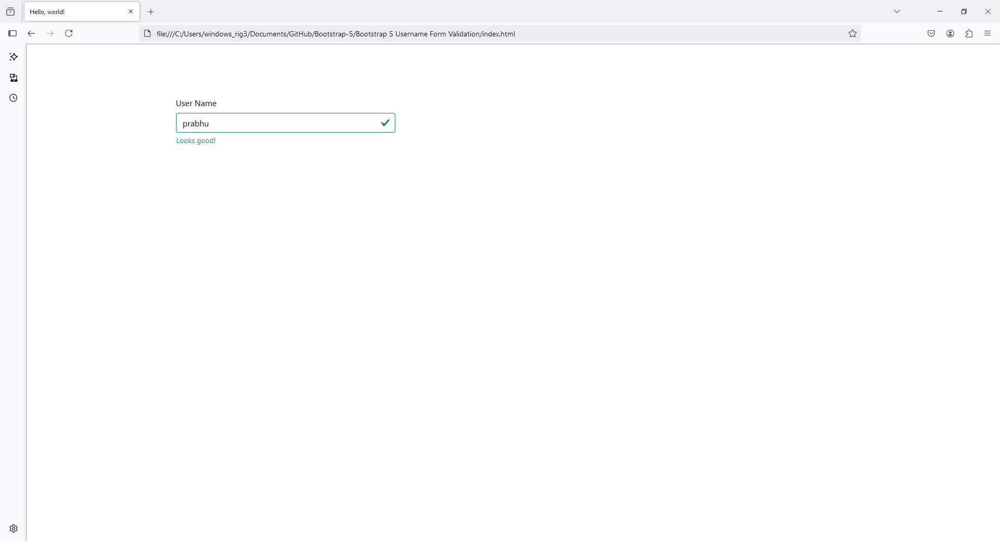
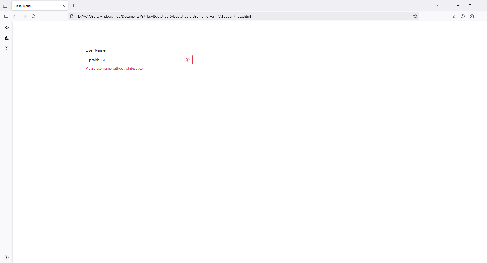

`index.html`

```
<!doctype html>
<html lang="en">
  <head>
    <!-- Required meta tags -->
    <meta charset="utf-8">
    <meta name="viewport" content="width=device-width, initial-scale=1">

    <!-- Bootstrap CSS -->
    <link href="https://cdn.jsdelivr.net/npm/bootstrap@5.1.3/dist/css/bootstrap.min.css" rel="stylesheet" integrity="sha384-1BmE4kWBq78iYhFldvKuhfTAU6auU8tT94WrHftjDbrCEXSU1oBoqyl2QvZ6jIW3" crossorigin="anonymous">

    <title>Hello, world!</title>
  </head>
  <body class="container" style="margin-top: 100px;">
    
    <form class="row g-3 needs-validation" novalidate>

        <div class="col-md-4">

          <label for="username" class="form-label">User Name</label>

          <input type="text" class="form-control" id="username" required>

          <div class="valid-feedback">
            Looks good!
          </div>

          <div class="invalid-feedback">
            Please username without whitespace.
          </div>

        </div>
    </form>

    <!-- Optional JavaScript; choose one of the two! -->

    <!-- Option 1: Bootstrap Bundle with Popper -->
    <script src="https://cdn.jsdelivr.net/npm/bootstrap@5.1.3/dist/js/bootstrap.bundle.min.js" integrity="sha384-ka7Sk0Gln4gmtz2MlQnikT1wXgYsOg+OMhuP+IlRH9sENBO0LRn5q+8nbTov4+1p" crossorigin="anonymous"></script>

    <!-- Option 2: Separate Popper and Bootstrap JS -->
    <!--
    <script src="https://cdn.jsdelivr.net/npm/@popperjs/core@2.10.2/dist/umd/popper.min.js" integrity="sha384-7+zCNj/IqJ95wo16oMtfsKbZ9ccEh31eOz1HGyDuCQ6wgnyJNSYdrPa03rtR1zdB" crossorigin="anonymous"></script>
    <script src="https://cdn.jsdelivr.net/npm/bootstrap@5.1.3/dist/js/bootstrap.min.js" integrity="sha384-QJHtvGhmr9XOIpI6YVutG+2QOK9T+ZnN4kzFN1RtK3zEFEIsxhlmWl5/YESvpZ13" crossorigin="anonymous"></script>
    -->

    <script src="app.js"></script>
  </body>
</html>
```

`main.js`

```
document.querySelector('#username').addEventListener('blur', validateUserName);

const reSpaces = /^\S*$/;

function validateUserName(e) {
    
    const username = document.querySelector('#username');

    if (reSpaces.test(username.value)) {
        username.classList.remove('is-invalid');
        username.classList.add('is-valid');
        return true;
    }
    else {
        username.classList.add('is-invalid');
        username.classList.remove('is-valid');
        return false;
    }
}
```





