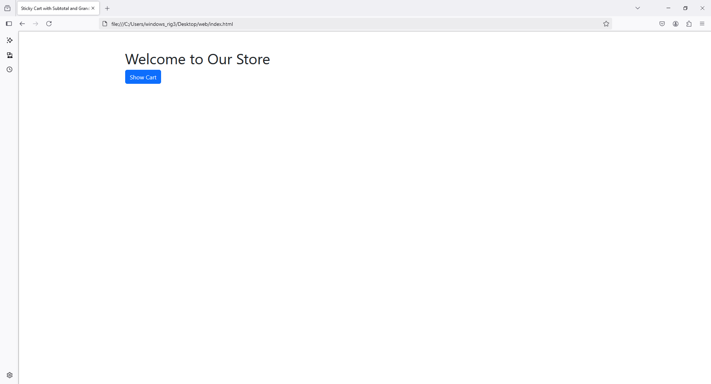
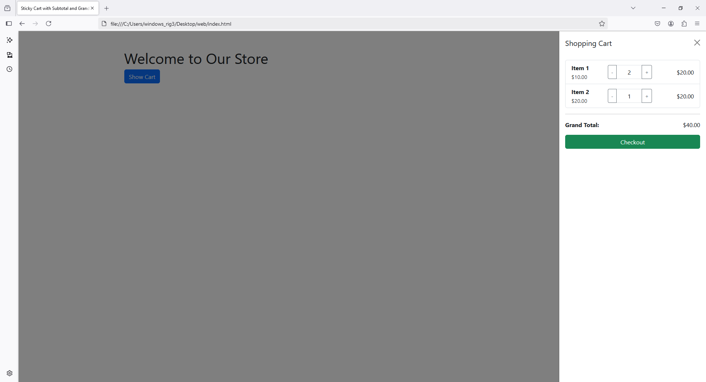

To include **subtotal** for each item and a **grand total** for all items in the cart, you can update the cart structure to dynamically calculate these values. Here's the updated implementation:

### Updated Code with Subtotal and Grand Total:

```html
<!DOCTYPE html>
<html lang="en">
<head>
    <meta charset="UTF-8">
    <meta name="viewport" content="width=device-width, initial-scale=1.0">
    <title>Sticky Cart with Subtotal and Grand Total</title>
    <link href="https://cdn.jsdelivr.net/npm/bootstrap@5.3.2/dist/css/bootstrap.min.css" rel="stylesheet">
</head>
<body>
    <div class="container mt-5">
        <!-- Main Content -->
        <h1>Welcome to Our Store</h1>
        <button class="btn btn-primary" data-bs-toggle="offcanvas" data-bs-target="#cartOffcanvas" aria-controls="cartOffcanvas">
            Show Cart
        </button>
    </div>

    <!-- Right-Side Sticky Cart -->
    <div class="offcanvas offcanvas-end" tabindex="-1" id="cartOffcanvas" aria-labelledby="cartOffcanvasLabel">
        <div class="offcanvas-header">
            <h5 class="offcanvas-title" id="cartOffcanvasLabel">Shopping Cart</h5>
            <button type="button" class="btn-close" data-bs-dismiss="offcanvas" aria-label="Close"></button>
        </div>
        <div class="offcanvas-body">
            <ul class="list-group" id="cartItems">
                <!-- Item 1 -->
                <li class="list-group-item d-flex justify-content-between align-items-center">
                    <div>
                        <strong>Item 1</strong><br>
                        <small>$10.00</small>
                    </div>
                    <div class="input-group" style="width: 120px;">
                        <button class="btn btn-outline-secondary btn-sm" onclick="updateQuantity('item1', 10, -1)">-</button>
                        <input type="text" id="item1" class="form-control text-center" value="1" readonly>
                        <button class="btn btn-outline-secondary btn-sm" onclick="updateQuantity('item1', 10, 1)">+</button>
                    </div>
                    <span id="subtotal-item1" class="ms-3">$10.00</span>
                </li>

                <!-- Item 2 -->
                <li class="list-group-item d-flex justify-content-between align-items-center">
                    <div>
                        <strong>Item 2</strong><br>
                        <small>$20.00</small>
                    </div>
                    <div class="input-group" style="width: 120px;">
                        <button class="btn btn-outline-secondary btn-sm" onclick="updateQuantity('item2', 20, -1)">-</button>
                        <input type="text" id="item2" class="form-control text-center" value="1" readonly>
                        <button class="btn btn-outline-secondary btn-sm" onclick="updateQuantity('item2', 20, 1)">+</button>
                    </div>
                    <span id="subtotal-item2" class="ms-3">$20.00</span>
                </li>
            </ul>
            <hr>
            <div class="d-flex justify-content-between">
                <strong>Grand Total:</strong>
                <span id="grandTotal">$30.00</span>
            </div>
            <button class="btn btn-success w-100 mt-3">Checkout</button>
        </div>
    </div>

    <script>
        // Function to update quantity and recalculate totals
        function updateQuantity(itemId, price, change) {
            const input = document.getElementById(itemId);
            const subtotalSpan = document.getElementById(`subtotal-${itemId}`);
            let currentValue = parseInt(input.value);
            let newValue = currentValue + change;

            if (newValue >= 1) { // Prevent quantity from dropping below 1
                input.value = newValue;
                let subtotal = newValue * price;
                subtotalSpan.textContent = `$${subtotal.toFixed(2)}`;
                updateGrandTotal();
            }
        }

        // Function to update grand total
        function updateGrandTotal() {
            const items = document.querySelectorAll('[id^="subtotal-item"]');
            let grandTotal = 0;

            items.forEach((item) => {
                let subtotal = parseFloat(item.textContent.replace('$', ''));
                grandTotal += subtotal;
            });

            document.getElementById('grandTotal').textContent = `$${grandTotal.toFixed(2)}`;
        }
    </script>

    <script src="https://cdn.jsdelivr.net/npm/bootstrap@5.3.2/dist/js/bootstrap.bundle.min.js"></script>
</body>
</html>
```

### Features Added:
1. **Subtotal**:
   - Each item has a `span` element showing its subtotal, dynamically updated based on the quantity.

2. **Grand Total**:
   - A `Grand Total` value sums up all subtotals and updates dynamically whenever the quantity changes.

3. **JavaScript Logic**:
   - The `updateQuantity` function recalculates the subtotal for the specific item and calls `updateGrandTotal` to update the grand total.
   - The `updateGrandTotal` function iterates through all item subtotals to calculate the total amount.

4. **Dynamic Updates**:
   - Totals are automatically recalculated and displayed whenever the user clicks the **+** or **-** buttons.

This implementation ensures that the cart dynamically updates the subtotal for each item and the grand total for all items in real-time.







